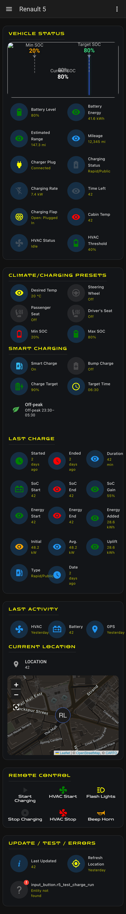
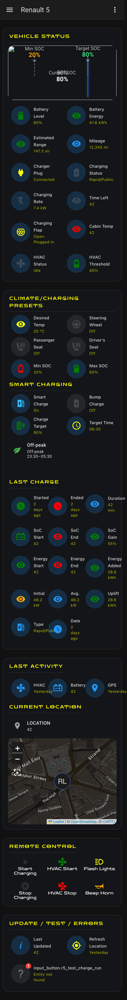
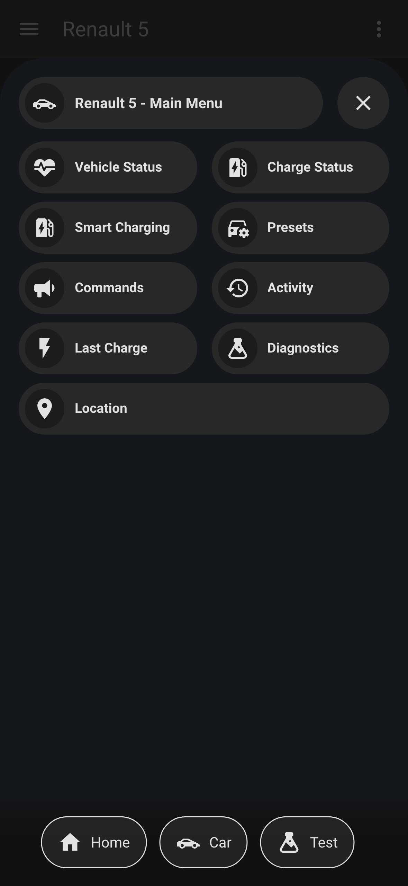
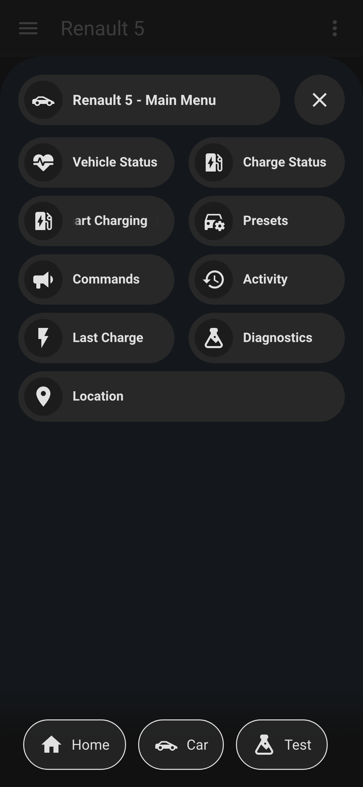
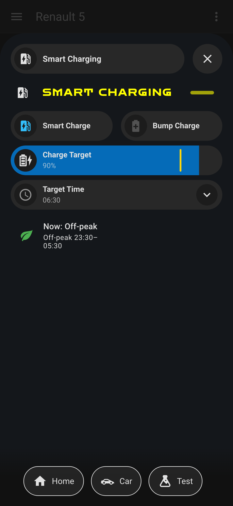

# Dashboards on mobile

The bundled Renault 5 dashboards are designed for phones and **automatically tested** on every
change: a CI job renders them in a real Home Assistant across the top mobile device sizes and
fails the build if any text is truncated or any card fails to render. Typography is the same on
every screen (no font/size changes between phone and desktop); labels and headings **wrap on
clean word breaks** rather than getting cut off.

Devices validated each run: **iPhone 15 Pro Max, iPhone 15 Pro, iPhone 15, iPhone SE, Pixel 8,
Pixel 7a, Galaxy S24, Galaxy S23, Galaxy A54, and a 360 px narrow Android bound.**

## Standard dashboard

| iPhone 15 Pro (393 px) | Galaxy S24 (360 px) |
| --- | --- |
|  |  |

## Bubble dashboard

| iPhone 15 Pro (393 px) | Galaxy S24 (360 px) |
| --- | --- |
|  |  |

## Smart Charging (optional)

With the `charger_*` options set, the Smart Charging controls appear on both dashboards — a
pop-up "tab" on the bubble dashboard (below) and a matching block on the standard one.

> Screenshots are produced by the **UI Tests** workflow ([`ui-tests/`](../ui-tests/)) in dark
> mode with representative sample data (no real account/location data). The full per-device set
> is uploaded as a build artifact on every run, and the shots above are **auto-refreshed** on
> any PR that changes the dashboards (committed back to the PR branch), so they never go stale.
